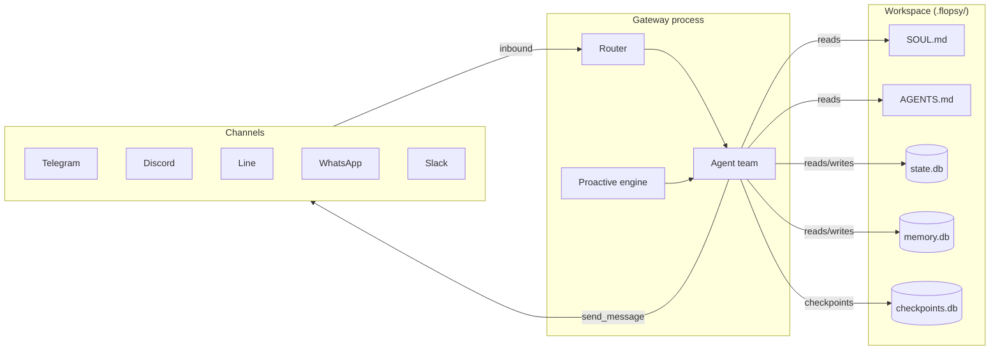

# FlopsyBot Documentation

FlopsyBot is a personal AI assistant that lives on the messaging channels you already use — Telegram, Discord, WhatsApp, Slack, Line, iMessage, Signal, Google Chat. One gateway process fans out to every channel, routes conversations to a small team of specialist agents, and learns from each interaction through a persistent memory layer.

This documentation is organized around the pieces you configure, the commands you run, and the files you edit.

## Quick start

```bash
# 1. Inspect what's configured
flopsy doctor              # health check
flopsy status              # live snapshot

# 2. Wire a channel (interactive)
flopsy onboard

# 3. Start the gateway
flopsy gateway start       # or: flopsy run start
```

## Documentation map

| Document | What it covers |
|---|---|
| [Architecture](./architecture.md) | System overview, process model, data flow |
| [CLI reference](./cli.md) | Every `flopsy ...` command with examples |
| [Agents](./agents.md) | The team — main + workers, roles, types, models |
| [Skills](./skills.md) | The skill library — what they are and how to add one |
| [Tools](./tools.md) | Built-in tool catalog (delegate, send_message, ask_user, …) |
| [MCP](./mcp.md) | Adding Model Context Protocol servers + per-agent routing |
| [Channels](./channels.md) | Configuring messaging channels |
| [Gateway](./gateway.md) | Gateway daemon, management endpoint, lifecycle |
| [Proactive](./proactive.md) | Heartbeats, cron scheduler, inbound webhooks |
| [Memory](./memory.md) | SOUL.md, AGENTS.md, state.db, memory.db, the memory tool |

## The 30-second mental model



- **Inbound**: every channel adapter translates platform-specific events into a unified message shape and hands them to the router.
- **Team**: a main agent (`gandalf` by default) receives, plans, and either answers or delegates to a worker (`legolas`, `saruman`, `gimli`).
- **Outbound**: agents call `send_message(channel, peer, text)` — the router picks the right channel adapter.
- **Proactive**: heartbeats fire on a schedule, cron jobs emit messages, inbound webhooks wake the agent without a user turn.
- **Memory**: persona (`SOUL.md`) + operations (`AGENTS.md`) are loaded once per agent build; `state.db` (threads, messages, user facts) and `memory.db` (vector memory) are updated every turn.

## File locations

```
flopsy.json5                     # single source of truth for config
.env                             # secrets (bot tokens, API keys)
.flopsy/                         # runtime workspace
├── SOUL.md                      # persona — voice, tone, mannerisms
├── AGENTS.md                    # operations manual — what to do
├── skills/                      # skill library (markdown definitions)
├── harness/
│   ├── state.db                 # threads, messages, user facts (SQLite + FTS5)
│   ├── memory.db                # vector memory (embeddings)
│   └── checkpoints.db           # paused turns (LangGraph-style)
└── logs/                        # gateway.log
```

## Where to go next

- New to FlopsyBot? Start with **[Architecture](./architecture.md)** for the big picture, then **[CLI](./cli.md)** for hands-on usage.
- Building a custom bot? Jump to **[Agents](./agents.md)** and **[Memory](./memory.md)**.
- Integrating with other systems? See **[MCP](./mcp.md)** and **[Proactive → Webhooks](./proactive.md#inbound-webhooks)**.
