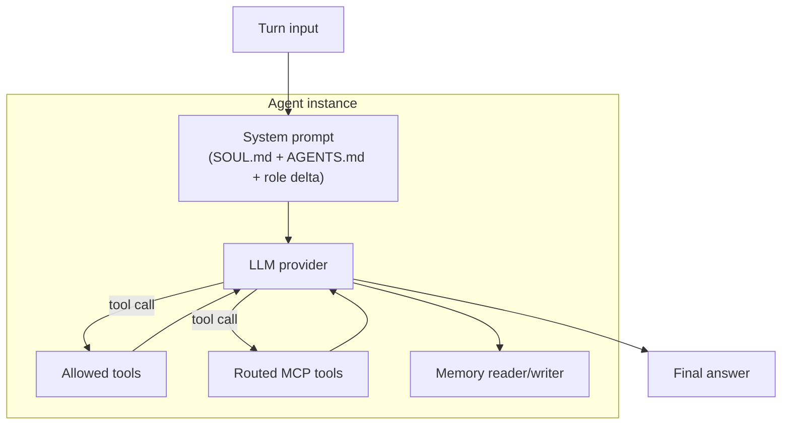
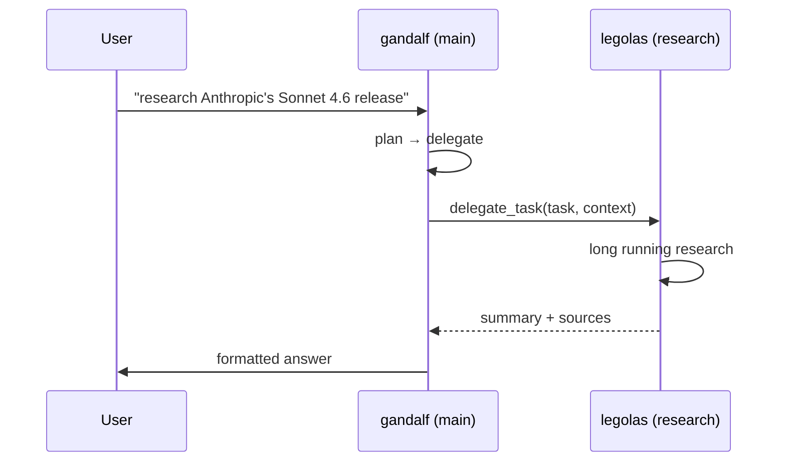

# Agents

FlopsyBot runs a small **team** of agents: one main, several workers. The main talks to the user; workers do specialised heavy lifting (deep research, coding, scheduling) on request. Every agent is defined declaratively in `flopsy.json5` — no code change is needed to add or reshape the team.

## The default team

| Agent | Role | Type | Default model | Responsibility |
|---|---|---|---|---|
| `gandalf` | main | main | `ollama:glm-4.6:cloud` | User-facing coordinator, plans + delegates |
| `legolas` | worker | worker | `ollama:qwen3.5:27b` | Web / Google research, summaries |
| `gimli` | worker | worker | `ollama:gemma4:e4b` | Notion / Obsidian / Apple notes / Apple reminders / Todoist |
| `saruman` | worker | deep-research | (provider-flex) | Long-horizon multi-round research |
| `aragorn` | worker | worker | (provider-flex) | OSINT — Twitter, VirusTotal, Shodan |

`flopsy team` shows the roster; `flopsy model list` shows the models; `flopsy model use <agent> <model>` switches one.

### Per-role tool surface

| Role | Always available |
|---|---|
| **main** (gandalf) | `send_message`, `send_poll`, `ask_user`, `react`, `delegate_task`, `spawn_background_task`, `search_conversation_history`, `connect_service`, `skill_manage`, `manage_schedule` |
| **worker** | `delegate_task` (chain up to depth 3), `spawn_background_task`, `notify_teammate`, `skill_manage` |

Workers can author skills — the same `skill_manage(create)` tool gandalf has. The reflection-nudge interceptor fires after 5 tool calls in a turn, prompting the agent to capture reusable procedures.

Under proactive fires (`proactiveMode: true`), the main agent loses `send_message`, `delegate_task`, `spawn_background_task`, `ask_user`, `react`, `send_poll`, and `manage_schedule` — the engine handles delivery, and the agent must return prose or structured `__respond__` output. `skill_manage` stays available.

## Anatomy of an agent



Each agent is a plain record in `agents[]`:

```json5
{
  name: "gandalf",
  type: "main",
  role: "main",
  enabled: true,
  model: "ollama:glm-4.6:cloud",
  toolsets: ["core", "team", "memory"],
  workers: ["legolas", "saruman", "gimli"],
  mcpServers: ["github", "google-workspace"],
  approvals: {
    tools: ["send_poll", "send_payment"],
    actions: ["delete_thread"]
  }
}
```

Field-by-field:

- **`name`** — unique identifier used by CLI, delegation, and logs.
- **`type`** — architectural kind: `main` (coordinator), `worker` (specialist). Controls default prompt delta.
- **`role`** — logical role: `main` / `worker`. Exactly one enabled agent must have `role: main`.
- **`enabled`** — `false` keeps the record but hides the agent from the team.
- **`model`** — provider-prefixed model id (`ollama:*`, `anthropic:*`, `openai:*`, …).
- **`toolsets`** — named bundles of built-in tools (see [Tools](./tools.md)).
- **`workers`** — which other agents this one can delegate to via `delegate_task`.
- **`mcpServers`** — allow-list of MCP server names whose tools this agent may call. Agents only see tools from servers they're allow-listed for.
- **`approvals`** — tools / actions that require human confirmation before execution.

## System prompt construction

Every agent's system prompt is assembled at team-build time from three layers:

```
IDENTITY_OPENER          ← hard-coded in code (who you are, what storage you have)
## Your Persona          ← SOUL.md content (voice, tone, mannerisms)
## Your Operations Manual ← AGENTS.md content (what to do, patterns to follow)
## Your Role             ← ROLE_DELTA[role][type] (e.g. "You are the main...")
<runtime>                ← DYNAMIC per turn (date, channel, peer, capabilities)
```

The first four blocks are cached — built once per agent instance. The `<runtime>` block is regenerated per invocation and appended after the cache boundary, so the LLM provider's prefix cache stays warm for the expensive prefix.

Changes to `SOUL.md` / `AGENTS.md` take effect on the next **agent build**, which happens at gateway startup. `flopsy gateway restart` applies them.

## Roles vs types

FlopsyBot distinguishes two orthogonal axes:

- **Role** (`main` / `worker`) — logical position in the team hierarchy.
- **Type** — architectural template (`main`, `worker`, `research`, `coding`, `scheduling`). Controls which role-delta snippet is appended.

Most agents have `type === role`. A worker built from a specific type gets a tailored snippet — e.g. the `coding` type primes the agent to prefer code-review workflows.

`deep-research` is special-cased: it ignores `SOUL.md` / `AGENTS.md` entirely and uses baked-in research prompts. If you set `type: "research"` you get that behaviour.

## Delegation flow



Under the hood:

- `delegate_task` is a built-in tool the main has access to.
- The worker runs in an isolated thread (its own conversation history).
- The worker's reply is inserted back into the main's turn as a tool result.
- Token usage is tracked per-agent and summed at the main's turn level (visible in `flopsy mgmt status`).

## Managing the team

```bash
flopsy team                         # list roster with status dots
flopsy team show gandalf            # full detail for one agent
flopsy model list                   # models per agent
flopsy model use gimli ollama:llama3.2:3b

# Enable / disable an agent
flopsy config set agents.2.enabled false

# Add a new worker (append to agents[])
flopsy config set agents.4 '{"name":"elrond","type":"worker","role":"worker","enabled":true,"model":"ollama:qwen3.5:27b","toolsets":["core"]}'
```

Changes require `flopsy gateway restart` to take effect (the team is built at startup).

## Observability

- `flopsy status` shows the roster + enabled count.
- `flopsy mgmt status` shows live per-agent token usage (current day).
- Gateway logs carry `agent:<name>` on every turn line.

## Related

- [Skills](./skills.md) — how capabilities are packaged
- [Tools](./tools.md) — the tool catalog
- [MCP](./mcp.md) — per-agent MCP routing
- [Memory](./memory.md) — how state.db / memory.db / persona files fit together
