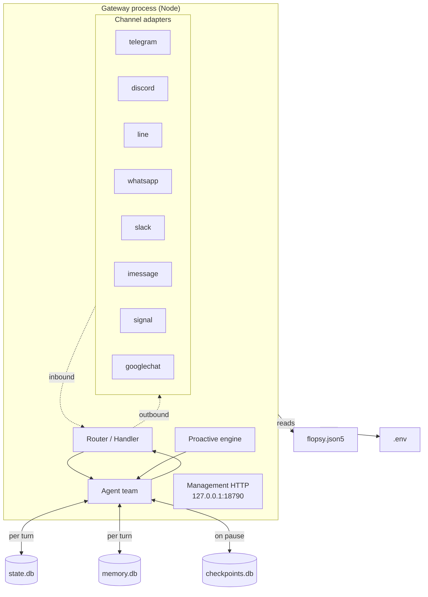
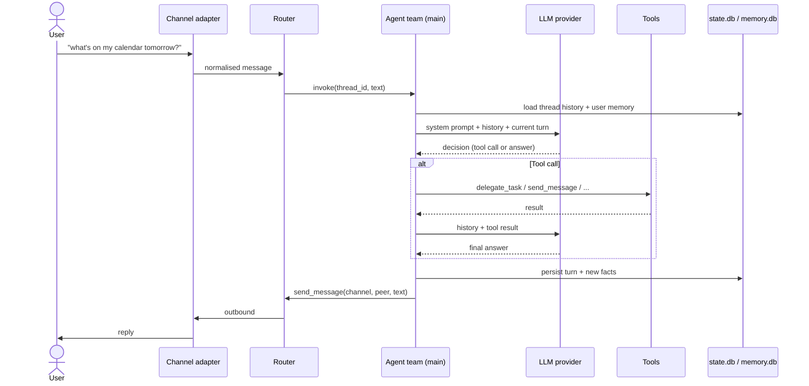
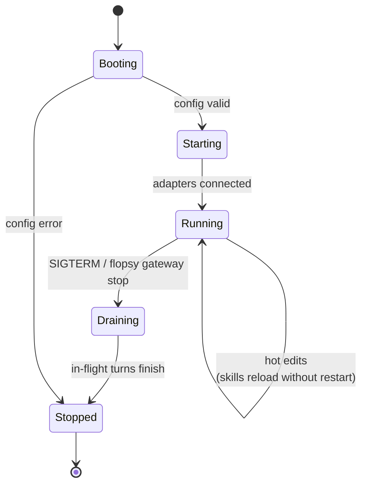

# Architecture

FlopsyBot is a single-process daemon that multiplexes many chat channels into one reasoning agent (with optional delegation to worker agents). This document explains the main components, how they fit together, and where state lives.

## Process model

One long-running Node process — the **gateway** — is the whole product. It hosts:

- N channel adapters (one per enabled channel)
- The agent team (main + workers)
- The proactive engine (heartbeats, cron, inbound webhooks)
- The management HTTP endpoint (for `flopsy mgmt`)
- Persistent storage handles (three SQLite databases + workspace files)



### Why a single process?

- **Context locality.** All channel state, memory, and agent reasoning sit in the same address space — no cross-process IPC for the hot path.
- **Simpler ops.** One binary, one log, one pid, one `flopsy gateway restart`.
- **Cheap to scale vertically.** FlopsyBot is designed to run on a $5 VPS — not a Kubernetes cluster.

When you outgrow the single process, the seam is the channel adapter: move an adapter to its own process and talk to the gateway over the management HTTP endpoint.

## Data flow: an inbound turn



Key properties of this loop:

- **Thread-scoped.** Every peer on every channel gets its own thread id. Threads don't leak across peers.
- **Checkpointed.** If the LLM call fails mid-turn, the half-turn is saved in `checkpoints.db` so it can resume after restart instead of replaying from scratch.
- **Observable.** Every step is logged with a correlation id so you can reconstruct a turn after the fact.

## Core subsystems

| Subsystem | Source location | Responsibility |
|---|---|---|
| Gateway | `src/gateway/` | Boots channel adapters, hosts router, runs mgmt HTTP |
| Team | `src/team/` | Builds agents from config, runs the react loop, owns tools |
| Shared | `src/shared/` | Config loader, workspace paths, logger, SQLite helpers |
| App | `src/app/` | `npm start` entry point — wires gateway + team |
| CLI | `src/cli/` | The `flopsy` binary (this doc suite) |

## Configuration layers

```
flopsy.json5   ─┐  JSON5 with comments. Shape validated by Zod.
                │  Env vars interpolated: ${FOO} / ${FOO:-default}.
.env           ─┤  Secrets (bot tokens, API keys).
                │  Auto-loaded from the directory containing flopsy.json5.
FLOPSY_HOME   ─┤  Absolute path to the workspace. Default: ./.flopsy
FLOPSY_CONFIG ─┘  Absolute path to a non-default config.
```

Precedence (highest wins):

1. `FLOPSY_CONFIG` env var → explicit path
2. Walk up from cwd for `flopsy.json5`
3. Walk up from CLI install location (for `flopsy` run outside the project)

## Lifecycle



- **Booting**: load `.env`, parse config, initialize loggers + databases.
- **Starting**: spawn channel adapters, open MCP servers, bind the mgmt HTTP port.
- **Running**: accept inbound messages, run turns, persist state.
- **Draining**: new messages 503; in-flight turns finish. Checkpoints ensure nothing is lost if a turn is mid-LLM when the signal arrives.
- **Stopped**: databases closed, pid file removed.

## Cross-reference

- **Want to extend the agent?** → [Agents](./agents.md), [Tools](./tools.md), [Skills](./skills.md)
- **Want to connect an external service?** → [MCP](./mcp.md), [Channels](./channels.md)
- **Want the agent to act on a schedule?** → [Proactive](./proactive.md)
- **Want to understand what persists?** → [Memory](./memory.md)
