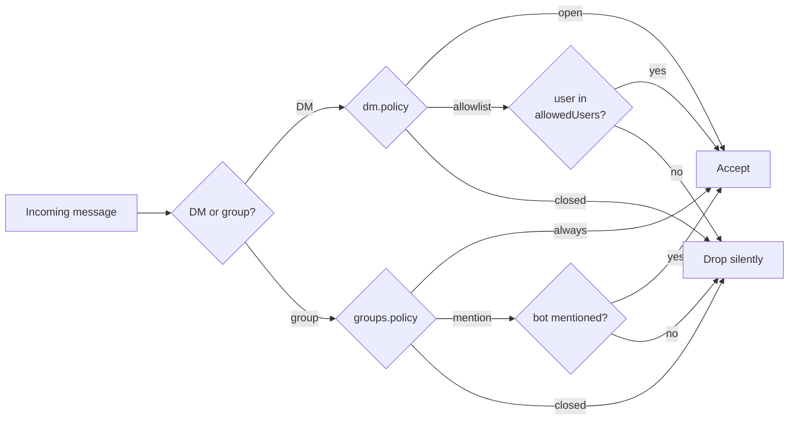

# Channels

A **channel** is a messaging platform FlopsyBot listens on. The gateway runs an adapter per enabled channel; each adapter translates platform events into a unified inbound shape and translates outbound messages back into platform-native API calls.

## Supported channels

| Channel | Adapter type | Typical auth | Native capabilities |
|---|---|---|---|
| Telegram | bot API | Bot token | Buttons, polls, media, reactions |
| Discord | bot gateway | Bot token + app token | Buttons, media, reactions, threads |
| Line | messaging API | Channel secret + access token | Quick replies, media, stickers |
| WhatsApp | Meta Cloud API / Signal bridge | Phone + Meta app | Text, media (no buttons) |
| Slack | bot + signing secret | Bot token + signing secret | Blocks, buttons, modals |
| iMessage | local BlueBubbles / Beeper | Mac with Messages | Text, media (no buttons) |
| Signal | Signal-CLI bridge | Registered Signal account | Text, media (no buttons) |
| Google Chat | Workspace app | Service account + verification token | Cards, buttons |

`flopsy status` shows which are enabled. `flopsy channel list` lists them with status dots.

## Anatomy of a channel config

```json5
{
  channels: {
    telegram: {
      enabled: true,
      token: "${TELEGRAM_BOT_TOKEN}",
      dm: {
        policy: "open",             // open | allowlist | closed
        allowedUsers: []            // ignored when policy === "open"
      },
      groups: {
        policy: "mention",          // mention | always | closed
        allowedGroups: []
      },
      homeChannel: null,            // optional peer id for proactive messages
      capabilities: ["buttons", "polls", "media", "reactions"]
    }
  }
}
```

Fields common to every channel:

- **`enabled`** — gate the adapter entirely.
- **`token` / credentials** — platform-specific.
- **`dm.policy`** — who can DM the bot: `open` (anyone), `allowlist` (only `allowedUsers`), `closed` (nobody).
- **`groups.policy`** — when to engage in groups: `mention` (only when mentioned), `always`, `closed`.
- **`homeChannel`** — a peer id the proactive engine can send to without inbound context.
- **`capabilities`** — declared at boot time; used by tools like `ask_user` to decide between buttons vs numbered text.

## Inbound flow

```mermaid
sequenceDiagram
    participant Platform as Platform API
    participant Adapter as Channel adapter
    participant Router
    participant Team

    Platform->>Adapter: webhook / long-poll event
    Adapter->>Adapter: verify signature
    Adapter->>Adapter: normalise to<br/>{channel, peer, sender, text, capabilities}
    Adapter->>Router: dispatch
    Router->>Router: resolve thread id<br/>(channel + peer)
    Router->>Team: invoke(thread, text, capabilities)
    Team-->>Router: reply (via send_message tool)
    Router->>Adapter: outbound
    Adapter->>Platform: API call
```



The `capabilities` array travels with every turn — tools read it to decide how to render (buttons on rich channels, numbered fallback on text-only).

## CLI workflow

```bash
flopsy channel list                               # overview with dots
flopsy channel show telegram                      # full config, secrets masked
flopsy channel show telegram --reveal             # show token in plaintext
flopsy channel enable discord
flopsy channel disable signal
flopsy channel set telegram.dm.policy allowlist
flopsy channel add telegram                       # interactive wizard
```

Channel token setup is most easily done via `flopsy onboard` — it prompts for the required secret with masked input and writes it into `.env`.

## Group / DM policy matrix



## Rate limits + retries

- **Outbound rate limits**: adapters queue outbound messages and respect platform rate limits (e.g. Telegram's 30 msg/s per bot).
- **Retries**: transient 5xx errors retry with back-off (2, 4, 8 seconds, give up).
- **Ordering**: per-peer ordering is preserved; cross-peer messages may interleave.

## Proactive sends

Channels with a `homeChannel` can receive proactive messages (heartbeats, cron outputs). See [Proactive](./proactive.md).

Without a `homeChannel`, the proactive engine has nowhere to send — set one or route the message to an existing thread via `deliveryMode: "reply-latest"`.

## Writing a new channel adapter

Adapters live under `src/gateway/src/channels/<name>/`. Contract:

```ts
interface ChannelAdapter {
  name: string;
  capabilities: readonly string[];
  start(): Promise<void>;
  stop(): Promise<void>;
  send(peer: PeerId, payload: OutboundPayload): Promise<MessageId>;
  // inbound events are pushed to the router via an event emitter
}
```

Patterns to follow (see `src/gateway/src/channels/telegram/` as reference):

- Keep the normalisation pure — all platform-specific shapes collapse at the edge.
- Emit `capabilities` truthfully; tools depend on it.
- Don't swallow errors — propagate to the router with enough context to log.
- Use the shared `createLogger('channel:<name>')` so logs are grep-able.

## Related

- [Gateway](./gateway.md) — how adapters boot and register
- [CLI → `flopsy channel`](./cli.md#flopsy-channel-) — operational commands
- [Proactive](./proactive.md) — outbound traffic that doesn't originate from a user
