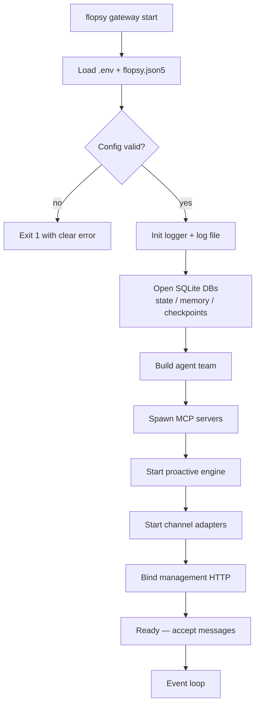

# Gateway

The gateway is the FlopsyBot daemon — a single Node process that hosts channel adapters, the agent team, the proactive engine, and a small management HTTP endpoint. When people say "FlopsyBot is running", they mean the gateway is up.

## Starting + stopping

```bash
flopsy gateway start        # foreground (npm start under the hood)
flopsy gateway stop         # graceful shutdown
flopsy gateway restart      # stop → start
flopsy gateway status       # pid, uptime, port
```

`flopsy run` is the same command (older name, kept as alias). `npm start` is the underlying entry point — the CLI just shells out to it so whatever the repo's `package.json` scripts define stays the source of truth.

## Configuration

`flopsy.json5` `gateway` block:

```json5
{
  gateway: {
    host: "127.0.0.1",        // bind only to loopback by default
    port: 18789,              // main listening port (internal only)
    mgmt: {
      host: "127.0.0.1",
      port: 18790             // management HTTP (flopsy mgmt)
    }
  }
}
```

- **`host: "127.0.0.1"`** — loopback binding prevents exposure to LAN. Change to `0.0.0.0` only if you're fronting with a reverse proxy + TLS.
- **`port`** — main port for internal subsystems. Most operators never hit it directly.
- **`mgmt.port`** — where `flopsy mgmt ping|status` connects. Defaults to `gateway.port + 1`.

## Boot sequence



Failure at any step logs a scoped error and exits. A partially-booted gateway never starts accepting traffic.

## Shutdown

Gateway catches `SIGINT` and `SIGTERM`:


Double-signal (two `SIGINT` in a row) forces immediate exit — use sparingly, may leave checkpoints dirty.

## Management HTTP endpoint

Binds to `127.0.0.1:<mgmt.port>` only — never exposed off-box. Endpoints:

| Method | Path | Purpose |
|---|---|---|
| `GET` | `/mgmt/ping` | Lightweight health probe. Returns `{ok, uptimeMs}` |
| `GET` | `/mgmt/status` | Full live snapshot — channels, threads, today's tokens, MCP state |

Auth is optional: set `FLOPSY_MGMT_TOKEN` to require `Authorization: Bearer <token>` on every request (except `/mgmt/ping`, which stays open so `flopsy mgmt ping` works before you configure the token). Without the env var, the endpoint accepts any localhost request.

The CLI consumes this:

```bash
flopsy mgmt ping                       # round-trip sanity
flopsy mgmt status                     # pretty snapshot
flopsy mgmt status --json              # machine-readable
```

Prefix `FLOPSY_MGMT_TOKEN=... flopsy mgmt status` when auth is enabled, or set it in your shell init.

## Observability

- **Log file** — `~/.flopsy/logs/gateway.log` (or `FLOPSY_HOME/logs/`). JSON lines; filter with `jq`.
- **Log level** — set via `logging.level` in `flopsy.json5` (`trace`, `debug`, `info`, `warn`, `error`).
- **Correlation ids** — every turn carries a `turn_id`; every tool call carries it forward. Use `jq 'select(.turn_id=="abc123")' logs/gateway.log` to reconstruct a turn.
- **Pid file** — `~/.flopsy/gateway.pid`; `flopsy gateway status` reads this.

## State files

The gateway owns three SQLite databases:

| File | Purpose | Write frequency |
|---|---|---|
| `state.db` | Threads, messages (FTS5), user facts | Every turn |
| `memory.db` | Vector memory (embeddings) | When memory write tools fire |
| `checkpoints.db` | Paused turns | On pause / crash recovery |

All three are opened with WAL mode; you'll see `-wal` + `-shm` sidecars. Safe to `ls -la` them, **not** safe to copy while the gateway is running — use `flopsy gateway stop` first or use SQLite's online backup via a custom script.

## Horizontal considerations

The gateway is designed to run as a single process per user. Multi-user / multi-tenant deployments should run one gateway per user with separate `FLOPSY_HOME` directories. A reverse proxy (Caddy, nginx) can front multiple gateways on different ports if you need URL-based routing.

## Related

- [Architecture](./architecture.md) — bigger-picture process model
- [CLI → `flopsy gateway`](./cli.md#flopsy-gateway-startstoprestartstatus) — operational commands
- [CLI → `flopsy mgmt`](./cli.md#flopsy-mgmt-pingstatus) — live queries
- [Memory](./memory.md) — what each database stores
