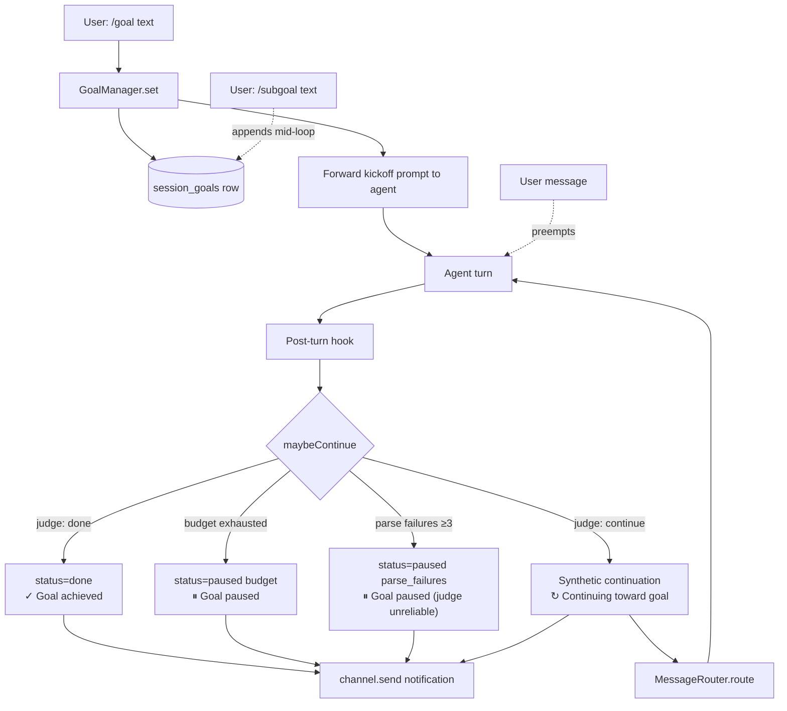

# Goal loop (`/goal` + `/subgoal`)

A **standing goal** is a directive the agent works toward across multiple turns until a judge model says it's done. Inspired by Codex CLI's Ralph loop and Hermes-agent's `/goal` + `/subgoal` commands.

## At a glance

```
You: /goal write a deploy script for the staging branch
Bot: GOAL SET panel
Bot: [first agent step — drafts the script]
Bot: ↻ Continuing toward goal (1/20): script drafted but not tested yet
Bot: [next agent step — runs the test]
Bot: ↻ Continuing toward goal (2/20): test passed, still need git tag
Bot: [next agent step — tags and pushes]
Bot: ✓ Goal achieved: deploy.sh committed, tagged v1.2.0, pushed to staging
```

The loop continues until:
- The **judge** (an auxiliary LLM) says the goal is satisfied → `✓ Goal achieved: <reason>`
- The turn-budget (default 20) is exhausted → `⏸ Goal paused — N/20 turns used.`
- The judge fails to produce parseable JSON 3+ times in a row → `⏸ Goal paused — the judge model isn't returning the required JSON verdict.`
- You send a real message → loop yields to you for that turn
- You run `/goal pause` or `/goal clear`

Every iteration emits a one-line **notification** to the channel so you see what the judge decided and why. Notifications are core UX, not optional — if you opted into `/goal`, you opted into seeing the loop tick.

## The slash commands

```
/goal <text>           Set or replace the goal for this thread
/goal status           Show current goal + turns_used/max_turns + last verdict
/goal pause            Stop the loop (state stays in DB; /goal resume re-arms it)
/goal resume           Reactivate (turn counter resets, parse failures cleared)
/goal clear            Delete the goal entirely (alias: /goal stop)

/subgoal <text>        Append a criterion to the active goal (requires active /goal)
/subgoal               List current subgoals
/subgoal remove <N>    Remove subgoal at 1-based index N (alias: /subgoal rm <N>)
/subgoal clear         Wipe all subgoals (keeps the original /goal)
```

Setting a new goal kicks off the loop immediately — the slash handler returns a small "GOAL SET" panel and forwards an internal "take the first concrete step toward this goal now" message to the agent.

`/subgoal` layers additional criteria on the active goal mid-loop. The continuation prompt surfaces all subgoals to the agent verbatim, and the judge factors them into its DONE/CONTINUE verdict — the goal isn't marked done until the original goal **and** every subgoal are met.

## How it works



### Implementation map

| File | Role |
|---|---|
| `src/team/src/harness/goals/goal-manager.ts` | `GoalManager` — set/pause/resume/clear/maybeContinue/judge + add/remove/clear/render subgoals + notification message builder |
| `src/team/src/harness/storage/learning-store.ts` | `session_goals` table + CRUD (includes `subgoals` JSON column) |
| `src/team/src/handler.ts` (`TeamHandler.invoke`) | Post-turn hook calls `maybeContinue` and invokes BOTH the continuation callback and the notification callback |
| `src/gateway/src/commands/goal-facade.ts` | Singleton bridge so the slash handlers can see the live `GoalManager` |
| `src/gateway/src/commands/handlers/goal.ts` | `/goal` slash command |
| `src/gateway/src/commands/handlers/subgoal.ts` | `/subgoal` slash command |
| `src/gateway/src/gateway.ts` | Wires `setGoalContinuationCallback` (synthetic messages) **and** `setGoalNotificationCallback` (`channel.send` for the one-liner) |
| `src/cli/src/ops/goal-command.ts` | `flopsy goal` CLI |
| `src/cli/src/ui/components/slash-hints.ts` | TUI hints for `/goal` and `/subgoal` |

### The judge

An auxiliary LLM call (uses `extractorModel` from config) that reads the goal + the agent's most recent reply and returns:

```json
{"done": true, "reason": "ship script committed at <sha>"}
```

When subgoals exist, the judge prompt switches to a stricter variant that lists each criterion numerically and instructs the judge to require concrete evidence for **every** numbered criterion before saying DONE.

Fail-open semantics: if the judge errors or times out (default 30s), `maybeContinue` returns `verdict: 'continue'` so a transient model issue doesn't trap a real goal. If the judge keeps returning unparseable JSON, the loop auto-pauses after `maxConsecutiveParseFailures` (default 3) so a misbehaving model doesn't burn tokens forever.

### Synthetic continuation messages

When the judge says "continue", the GoalManager returns a `continuationPrompt`. The template depends on whether subgoals exist:

**Without subgoals:**
```
[Continuing toward your standing goal]
Goal: <the original goal text>

Continue working toward this goal. Take the next concrete step.
If you believe the goal is complete, state so explicitly and stop.
If you are blocked and need input from the user, say so clearly and stop.
```

**With subgoals:**
```
[Continuing toward your standing goal]
Goal: <the original goal text>

Additional criteria the user added mid-loop:
- 1. <subgoal 1>
- 2. <subgoal 2>
- ...

Continue working toward the goal AND all additional criteria. Take
the next concrete step. If you believe the goal and every
additional criterion are complete, state so explicitly and stop.
If you are blocked and need input from the user, say so clearly and stop.
```

The gateway wires this callback to `MessageRouter.route(...)` with `sender = { id: 'goal-loop' }`. From the channel-worker's perspective it looks like a normal inbound message — same coalescing, same dedup, same channel-worker. The agent doesn't know it wasn't typed by you.

### Notifications

Every `maybeContinue` result includes a user-visible one-liner sent directly via `channel.send` (separate path from the synthetic continuation). The four kinds:

| Kind | Message format |
|---|---|
| `continuing` | `↻ Continuing toward goal (N/MAX): <judge.reason>` |
| `done` | `✓ Goal achieved: <judge.reason>` |
| `budget` | `⏸ Goal paused — N/MAX turns used. Use /goal resume to keep going, or /goal clear to stop.` |
| `parse_failures` | `⏸ Goal paused — the judge model (N turns) isn't returning the required JSON verdict. Route extractorModel to a stricter model, then /goal resume to continue.` |

Notifications use Unicode symbols (↻ ✓ ⏸ ⊙ ▶) — the same character family the project allows (`∴ ● ✗`), not emoji.

### Preemption

If you send a real message while the loop is firing, the channel-worker's queue handles it just like any other user turn. The synthetic continuation for *this* round still gets processed if it's already in flight, but your message lands next. There's no `pause-on-user-activity` flag — that's intentional: the agent should read your message, respond, and *then* continue toward the goal (assuming the judge still says continue).

## Configuration

The judge model is whatever `config.extractorModel` resolves to (typically a cheap aux model — the same one used for `SessionExtractor` and `CommitmentsExtractor`). Goal-manager constructor accepts:

| Option | Default | Purpose |
|---|---|---|
| `maxTurns` | 20 | Budget — auto-pauses after N continuations |
| `judgeTimeoutMs` | 30,000 | Per-judge-call wall-clock cap |
| `maxConsecutiveParseFailures` | 3 | Pause threshold for unparseable judge replies |

Subgoal limits (constants in `goal-manager.ts`):

| Constant | Value | Purpose |
|---|---|---|
| `MAX_SUBGOAL_CHARS` | 400 | Per-subgoal character cap |
| `MAX_SUBGOALS_PER_GOAL` | 20 | Hard cap to prevent prompt bloat |

These are constructor-level defaults today; no runtime knobs in `flopsy.json5` yet.

## Database

```sql
CREATE TABLE session_goals (
    thread_id      TEXT PRIMARY KEY,
    goal           TEXT NOT NULL,
    status         TEXT NOT NULL CHECK (status IN ('active','paused','done','cleared')),
    turns_used     INTEGER NOT NULL DEFAULT 0,
    max_turns      INTEGER NOT NULL DEFAULT 20,
    parse_failures INTEGER NOT NULL DEFAULT 0,
    created_at     INTEGER NOT NULL,
    last_turn_at   INTEGER NOT NULL,
    last_verdict   TEXT,
    last_reason    TEXT,
    channel_name   TEXT NOT NULL,
    peer_id        TEXT NOT NULL,
    subgoals       TEXT NOT NULL DEFAULT '[]'
);
```

`subgoals` is a JSON array of strings, stored denormalised on the parent row (always read together, never queried by content, capped at 20 entries). One row per thread. The CLI reads + mutates this table directly so it works without the gateway running. The gateway re-reads the row every turn — no in-memory cache — so CLI mutations take effect on the next continuation.

## Operator workflow

```bash
# See what loops are running across all threads
flopsy goal list

# Drill into one
flopsy goal show telegram:123456789

# Pause a runaway loop from outside the chat
flopsy goal pause telegram:123456789

# Resume it later (counter reset to 0/20)
flopsy goal resume telegram:123456789
```

## Failure modes worth understanding

- **Judge returns "continue" forever** → safety net is `max_turns` (default 20). The loop auto-pauses; user can `/goal resume` to grant another budget.
- **Judge can't parse its own output** → after 3 consecutive parse failures, loop pauses with `stop_reason: parse_failures`.
- **Continuation never arrives** → check `lastTurnAt` in the row. If it's far in the past with status=`active`, the post-turn hook didn't fire — usually a TeamHandler error.
- **Notification never arrives** → notification callback runs independently of continuation callback. If continuation works but you don't see `↻ Continuing...` in chat, `setGoalNotificationCallback` may not be wired (check gateway.ts startup logs).
- **Subgoal causes the loop to never finish** → judge may be unable to find evidence for an overly-specific subgoal. Use `/subgoal remove <N>` to drop it, or `/goal pause` and rephrase.
- **Loop preempts a real message** → it doesn't; the synthetic continuation goes through the same channel worker, which queues fairly.

## Tests

- `src/team/src/harness/goals/__tests__/goal-manager.test.ts` — 24 cases:
  - 10 core: set/get/pause/resume/clear, budget exhaustion, parse-failure threshold, fail-open on judge error, fenced JSON parsing, AbortSignal timeout discipline
  - 5 notification: exact-string assertions on all four notification kinds + no-active-goal case
  - 9 subgoal: add/remove/clear/render, validation (empty, too-long, non-active-status), out-of-range index, subgoal-aware continuationPrompt, subgoal-aware judge prompt
- `src/gateway/tests/commands-goal.test.ts` — 7 cases on the `/goal` slash command: registration, facade plumbing, subcommand dispatch
- `src/gateway/tests/commands-subgoal.test.ts` — 10 cases on the `/subgoal` slash command: registration, no-facade warn, no-active-goal warn, add/list/remove/clear, usage errors, error surfacing from facade
