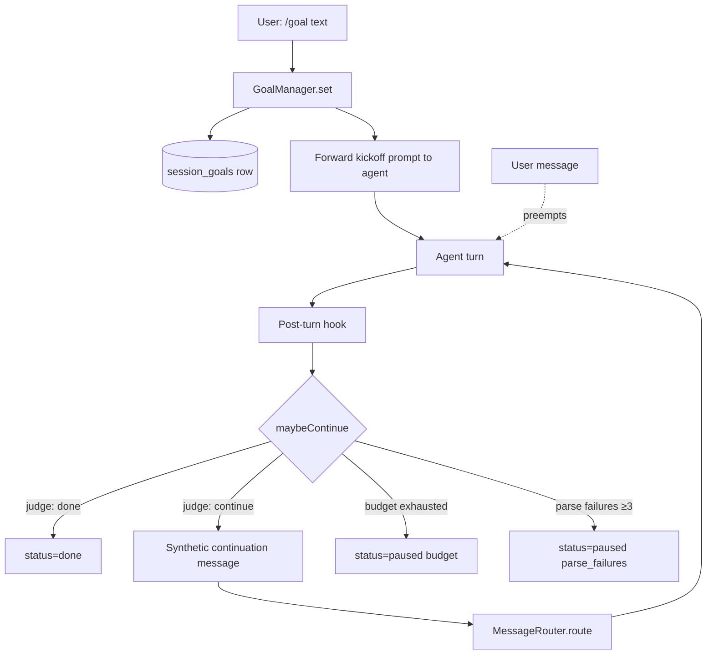

# Goal loop (`/goal`)

A **standing goal** is a directive the agent works toward across multiple turns until a judge model says it's done. Inspired by Codex CLI's Ralph loop and Hermes-agent's `/goal` command.

## At a glance

```
You: /goal write a deploy script for the staging branch
agent: [acknowledgment + first concrete step]
agent: [continues without you typing again] ← synthetic continuation
agent: ...
agent: [judge says done, loop exits]
```

The loop continues until:
- The **judge** (an auxiliary LLM) says the goal is satisfied
- The turn-budget (default 20) is exhausted → status `paused`
- The judge fails to produce parseable JSON 3+ times in a row → status `paused`
- You send a real message → loop yields to you for that turn
- You run `/goal pause` or `/goal clear`

## The slash command

```
/goal <text>           Set or replace the goal for this thread
/goal status           Show current goal + turns_used/max_turns + last verdict
/goal pause            Stop the loop (state stays in DB; /goal resume re-arms it)
/goal resume           Reactivate (turn counter resets, parse failures cleared)
/goal clear            Delete the goal entirely (alias: /goal stop)
```

Setting a new goal kicks off the loop immediately — the slash handler returns a small "GOAL SET" panel and forwards an internal "take the first concrete step toward this goal now" message to the agent.

## How it works



### Implementation map

| File | Role |
|---|---|
| `src/team/src/harness/goals/goal-manager.ts` | `GoalManager` — set/pause/resume/clear/maybeContinue/judge |
| `src/team/src/harness/storage/learning-store.ts` | `session_goals` table + CRUD (schema v4) |
| `src/team/src/handler.ts` (`TeamHandler.invoke`) | Post-turn hook calls `maybeContinue` and invokes the continuation callback |
| `src/gateway/src/commands/goal-facade.ts` | Singleton bridge so the slash handler can see the live `GoalManager` |
| `src/gateway/src/commands/handlers/goal.ts` | `/goal` slash command |
| `src/gateway/src/gateway.ts` | Wires `setGoalContinuationCallback` to inject synthetic messages via `MessageRouter.route` |
| `src/cli/src/ops/goal-command.ts` | `flopsy goal` CLI |

### The judge

An auxiliary LLM call (uses `extractorModel` from config) that reads the goal + the agent's most recent reply and returns:

```json
{"done": true, "reason": "ship script committed at <sha>"}
```

Fail-open semantics: if the judge errors or times out (default 30s), `maybeContinue` returns `verdict: 'continue'` so a transient model issue doesn't trap a real goal. If the judge keeps returning unparseable JSON, the loop auto-pauses after `maxConsecutiveParseFailures` (default 3) so a misbehaving model doesn't burn tokens forever.

### Synthetic continuation messages

When the judge says "continue", the GoalManager returns a `continuationPrompt`:

```
[Continuing toward your standing goal]
Goal: <the original goal text>

Continue working toward this goal. Take the next concrete step.
If you believe the goal is complete, state so explicitly and stop.
If you are blocked and need input from the user, say so clearly and stop.
```

The gateway wires this callback to `MessageRouter.route(...)` with `sender = { id: 'goal-loop' }`. From the channel-worker's perspective it looks like a normal inbound message — same coalescing, same dedup, same channel-worker. The agent doesn't know it wasn't typed by you.

### Preemption

If you send a real message while the loop is firing, the channel-worker's queue handles it just like any other user turn. The synthetic continuation for *this* round still gets processed if it's already in flight, but your message lands next. There's no `pause-on-user-activity` flag — that's intentional: the agent should read your message, respond, and *then* continue toward the goal (assuming the judge still says continue).

## Configuration

The judge model is whatever `config.extractorModel` resolves to (typically a cheap aux model — the same one used for `SessionExtractor` and `CommitmentsExtractor`). Goal-manager constructor accepts:

| Option | Default | Purpose |
|---|---|---|
| `maxTurns` | 20 | Budget — auto-pauses after N continuations |
| `judgeTimeoutMs` | 30,000 | Per-judge-call wall-clock cap |
| `maxConsecutiveParseFailures` | 3 | Pause threshold for unparseable judge replies |

These are constructor-level defaults today; no runtime knobs in `flopsy.json5` yet.

## Database

```sql
CREATE TABLE session_goals (
    thread_id      TEXT PRIMARY KEY,
    goal           TEXT NOT NULL,
    status         TEXT NOT NULL CHECK (status IN ('active','paused','done','cleared')),
    turns_used     INTEGER NOT NULL DEFAULT 0,
    max_turns      INTEGER NOT NULL DEFAULT 20,
    parse_failures INTEGER NOT NULL DEFAULT 0,
    created_at     INTEGER NOT NULL,
    last_turn_at   INTEGER NOT NULL,
    last_verdict   TEXT,
    last_reason    TEXT,
    channel_name   TEXT NOT NULL,
    peer_id        TEXT NOT NULL
);
```

One row per thread. The CLI reads + mutates this table directly so it works without the gateway running. The gateway re-reads the row every turn — no in-memory cache — so CLI mutations take effect on the next continuation.

## Operator workflow

```bash
# See what loops are running across all threads
flopsy goal list

# Drill into one
flopsy goal show telegram:123456789

# Pause a runaway loop from outside the chat
flopsy goal pause telegram:123456789

# Resume it later (counter reset to 0/20)
flopsy goal resume telegram:123456789
```

## Failure modes worth understanding

- **Judge returns "continue" forever** → safety net is `max_turns` (default 20). The loop auto-pauses; user can `/goal resume` to grant another budget.
- **Judge can't parse its own output** → after 3 consecutive parse failures, loop pauses with `stop_reason: parse_failures`.
- **Continuation never arrives** → check `lastTurnAt` in the row. If it's far in the past with status=`active`, the post-turn hook didn't fire — usually a TeamHandler error.
- **Loop preempts a real message** → it doesn't; the synthetic continuation goes through the same channel worker, which queues fairly.

## Tests

`src/team/src/harness/goals/__tests__/goal-manager.test.ts` — 10 cases covering set/get/pause/resume/clear, budget exhaustion, parse-failure threshold, fail-open on judge error, fenced JSON parsing, AbortSignal timeout discipline.

`src/gateway/tests/commands-goal.test.ts` — 7 cases on the slash command: registration, facade plumbing, subcommand dispatch.
