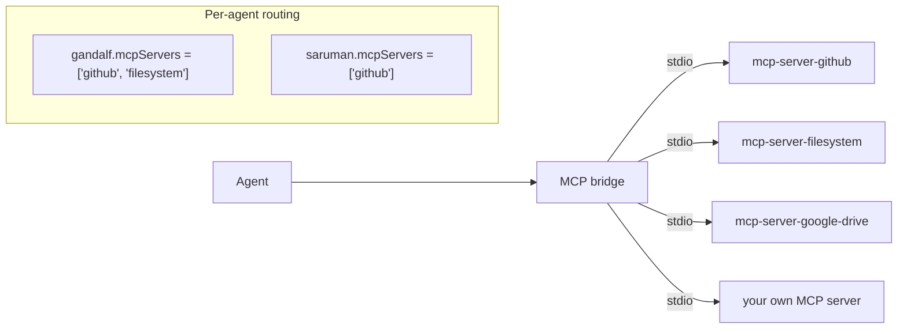
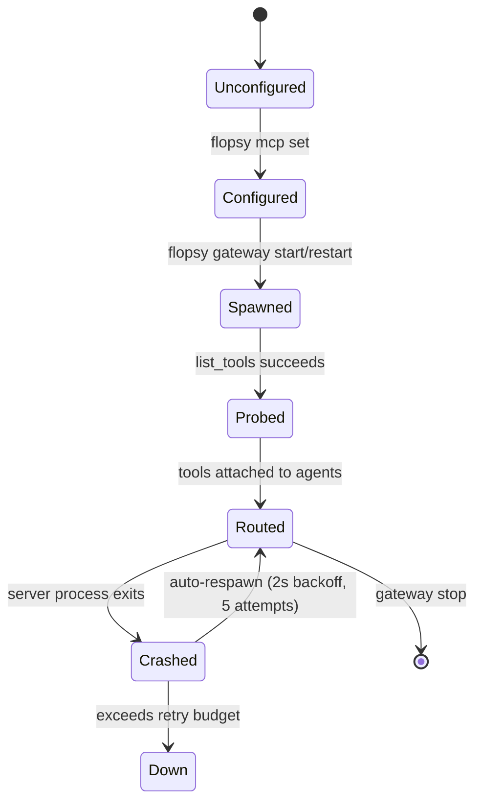

# MCP (Model Context Protocol)

MCP servers are external processes that expose tools to FlopsyBot's agents. They speak the [Model Context Protocol](https://modelcontextprotocol.io) over stdio — the gateway spawns them, calls their `list_tools`, and makes their tools available to agents that are allow-listed.

This is how you integrate GitHub, Google Drive, Notion, Slack admin APIs, filesystem access, and any other service that has an MCP server.

## Mental model



- One gateway → many MCP servers.
- One MCP server → many tools.
- Tools are namespaced at the gateway: `github__get_issue`, `filesystem__read_file`.
- Each agent sees only the servers in its `mcpServers` allow-list.

## Adding an MCP server

The `mcp.servers` block of `flopsy.json5`:

```json5
{
  mcp: {
    enabled: true,
    servers: {
      github: {
        enabled: true,
        transport: "stdio",
        command: "npx",
        args: ["-y", "@modelcontextprotocol/server-github"],
        env: {
          GITHUB_PERSONAL_ACCESS_TOKEN: "${GITHUB_TOKEN}"
        },
        requires: ["GITHUB_TOKEN"],
        assignTo: ["gandalf", "saruman"],
        description: "Issues, PRs, file reads on repos you own"
      },
      filesystem: {
        enabled: true,
        transport: "stdio",
        command: "npx",
        args: ["-y", "@modelcontextprotocol/server-filesystem", "/Users/me/projects"],
        assignTo: ["gandalf"]
      }
    }
  }
}
```

Field-by-field:

- **`enabled`** — `false` keeps the entry but skips spawning it at startup.
- **`transport`** — `stdio` today; `http` planned.
- **`command` / `args`** — how to spawn the process. `npx -y ...` is the common pattern for Node-based servers.
- **`env`** — env vars injected into the child. Supports `${VAR}` interpolation from the gateway's environment.
- **`requires`** — env vars that MUST be set. `flopsy doctor` fails the check if any are missing.
- **`requiresAuth`** — credential providers (from `flopsy auth`) that must be connected.
- **`assignTo`** — allow-list of agent names that can see this server's tools. Empty / omitted = main agent only.
- **`description`** — shown in `flopsy mcp list`.

## CLI workflow

```bash
flopsy mcp list                              # all servers with status dots
flopsy mcp show github                       # full config dump
flopsy mcp routes                            # tool-to-agent routing table
flopsy mcp set github '{"command":"npx","args":["-y","@modelcontextprotocol/server-github"]}'
flopsy mcp enable github
flopsy mcp disable github
flopsy mcp remove github
```

After changes, restart the gateway so the process tree refreshes:

```bash
flopsy gateway restart
```

## Auth bridge

MCP servers often need OAuth credentials. FlopsyBot's `flopsy auth` subsystem stores tokens encrypted under `~/.flopsy/credentials/<provider>/`. When an MCP server declares `requiresAuth: ["google"]`, the gateway injects the provider's access token as `FLOPSY_GOOGLE_ACCESS_TOKEN` into the server's environment:

```json5
{
  "google-drive": {
    command: "npx",
    args: ["-y", "@modelcontextprotocol/server-google-drive"],
    requiresAuth: ["google"],
    env: {
      GOOGLE_ACCESS_TOKEN: "${FLOPSY_GOOGLE_ACCESS_TOKEN}"
    }
  }
}
```

Expired tokens are refreshed automatically (or flagged by `flopsy doctor`).

## Per-agent routing

By default an MCP server's tools go to the main agent. To restrict or expand:

```json5
assignTo: ["gandalf", "saruman"]    // main + one worker
```

- Workers without the server on their `mcpServers` allow-list don't see its tools — even indirectly via delegation.
- This is important for cost: worker agents running on cheaper models get a smaller tool surface.

`flopsy mcp routes` renders the effective routing as a table:

```
github         → gandalf, saruman
filesystem     → gandalf
google-drive   → gandalf
```

## Lifecycle



- **Auto-respawn**: a server that crashes is restarted with exponential back-off. After 5 failed attempts in a row, it's marked `down` and agents lose access. `flopsy doctor` surfaces this.
- **Startup timeout**: a server that takes > 30 s to respond to `list_tools` is killed; agents launch without it.

## Security

- MCP servers run with the gateway's privileges — treat them like any other subprocess.
- Prefer `npx -y @modelcontextprotocol/...` over custom paths so you get signed packages.
- Keep `assignTo` tight: don't hand a database-access MCP to every agent.
- Secrets go in `.env` via `${VAR}` interpolation. Never hard-code tokens in `flopsy.json5`.

## Building your own MCP server

Anything that speaks MCP over stdio works. The reference SDK is `@modelcontextprotocol/sdk`. Minimal server:

```bash
npm init -y
npm i @modelcontextprotocol/sdk
```

Then register it:

```bash
flopsy mcp set my-server '{
  "command": "node",
  "args": ["/Users/me/src/my-mcp-server/index.js"],
  "assignTo": ["gandalf"]
}'
flopsy gateway restart
flopsy mcp routes
```

## Related

- [Agents](./agents.md) — per-agent `mcpServers` allow-list
- [Tools](./tools.md) — how MCP tools fit alongside built-ins
- [CLI → `flopsy auth`](./cli.md#flopsy-auth-) — credential storage for MCP servers that need OAuth
