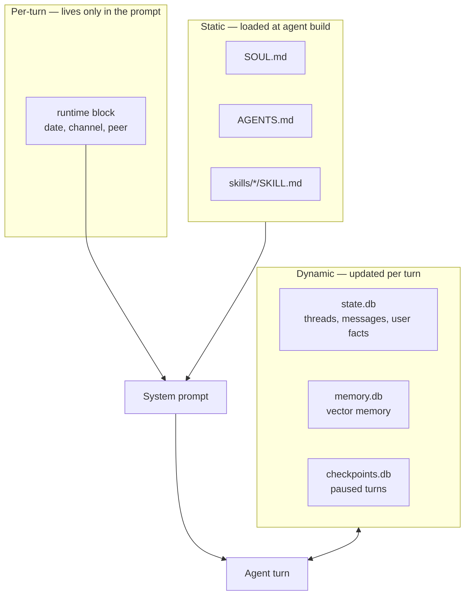

# Memory

FlopsyBot has several layers of memory — some static (markdown files baked into the prompt), some dynamic (databases updated every turn). This document explains each layer, when it's read, when it's written, and how to inspect / edit it.

## The layers at a glance



| Layer | Where | Format | Read | Written |
|---|---|---|---|---|
| Persona | `.flopsy/SOUL.md` | Markdown | Once per agent build | By you (editor) |
| Operations manual | `.flopsy/AGENTS.md` | Markdown | Once per agent build | By you (editor) |
| Skills | `.flopsy/skills/*/SKILL.md` | Markdown + YAML | On turn when triggered | By you (editor) |
| Thread / message log | `.flopsy/harness/state.db` | SQLite + FTS5 | Every turn | Every turn |
| User facts (cross-thread) | `.flopsy/harness/state.db` | SQLite table | By memory tool | By memory tool |
| Vector memory | `.flopsy/harness/memory.db` | SQLite + embeddings | By memory tool | By memory tool |
| Checkpoints | `.flopsy/harness/checkpoints.db` | SQLite | On resume after crash/pause | During pause |

## Static layer: the markdown files

### SOUL.md — persona

Defines voice, tone, mannerisms. Example:

```markdown
You are concise, warm, and technically precise. You don't pad with pleasantries.
When the user asks a question, answer it; ask for clarification only when
genuinely ambiguous. You avoid marketing-speak.

On multi-step tasks you narrate briefly ("let me check X, then Y") but don't
turn into a play-by-play announcer.
```

Loaded as `## Your Persona` block into every agent's system prompt. Shared across the whole team — every agent reads the same persona.

Edit with any text editor. Changes apply after `flopsy gateway restart`.

### AGENTS.md — operations manual

Team-wide conventions: how to hand off work, what tools to prefer, when to escalate, channel-specific patterns. Example:

```markdown
## Tool preferences
- For research, prefer delegating to `legolas` rather than running web_research inline.
- For coding, delegate to `saruman`; receive the result, review, and post.
- For schedule/calendar, delegate to `gimli`.

## Channel patterns
- In groups, be mentioned to engage; otherwise stay quiet.
- On Slack, use block formatting for code + tables.
- On SMS-style channels (iMessage, Signal, WhatsApp), keep replies under 500 chars.
```

Loaded as `## Your Operations Manual`. Same lifecycle as SOUL.md.

### Skill files

Each skill directory has a `SKILL.md` with frontmatter + instructions. Skills are matched and spliced into the prompt per-turn based on triggers. See [Skills](./skills.md) for the contract.

## Dynamic layer: the SQLite databases

All three databases live in `.flopsy/harness/` and are opened in WAL mode. Do not copy them while the gateway is running — use `flopsy gateway stop` first.

### state.db — threads, messages, user facts

The primary state store. Holds:

- **Threads** — one per `(channel, peer)` pair. Tracks start time, last activity, token totals.
- **Messages** — every inbound and outbound message, full text. Indexed by FTS5 for full-text search.
- **User facts** — cross-thread memory. Written by the memory tool when an agent learns something about the user worth remembering ("user prefers morning briefings at 08:00", "user's timezone is GMT+2").

Shape (simplified):

```
threads(id, channel, peer_id, started_at, last_active_at, token_in, token_out)
messages(id, thread_id, role, text, created_at)       -- FTS5 virtual table on text
user_facts(id, peer_id, fact, source_turn_id, created_at)
```

Accessed by built-in tools: `search_past_conversations` (FTS5 query), memory read/write helpers in the core toolset.

### memory.db — vector memory

Embeddings for semantic retrieval. Useful when you want "similar to" rather than "literally contains".

- Writes happen via the memory tool when the agent decides a message is worth remembering.
- Reads happen during prompt construction — the top-K most relevant memories are spliced into the turn context.
- Embedder is configurable; default is `nomic-embed-text:v1.5` via Ollama.

```json5
{
  memory: {
    enabled: true,
    embedder: {
      provider: "ollama",
      model: "nomic-embed-text:v1.5",
      baseUrl: "http://localhost:11434"
    }
  }
}
```

### checkpoints.db — paused turns

Stores in-flight turns that paused for human approval, waited on a long tool call, or were interrupted. When the gateway restarts, checkpointed turns resume from where they left off instead of replaying.

Also backs the `ask_user` tool — when an agent asks the user a question and blocks for a button response, the state lives here until the button fires.

Rarely something you inspect manually. `flopsy doctor` reports its writable status.

## The internal memory tool

Agents don't write to `state.db` / `memory.db` directly — they call memory tools:

| Tool | Writes to | When to use |
|---|---|---|
| `remember_fact(fact)` | `state.db.user_facts` | Cross-thread, stable truths about the user |
| `save_memory(content)` | `memory.db` (vector) | Episodic content worth retrieving later semantically |
| `search_past_conversations(query)` | reads `state.db` FTS5 | "Did we discuss X before?" |
| `recall_memory(query)` | reads `memory.db` vectors | "What do I know about topic X?" |

Agents learn to call these through guidance in `AGENTS.md` — e.g. "when the user mentions a preference, call `remember_fact` so it persists across threads".

## Inspecting memory

No dedicated CLI command exists today. Direct inspection paths:

```bash
# Full-text search user facts + messages
sqlite3 ~/.flopsy/harness/state.db \
  "SELECT role, substr(text, 1, 80) FROM messages ORDER BY created_at DESC LIMIT 20"

# List remembered facts
sqlite3 ~/.flopsy/harness/state.db \
  "SELECT fact, created_at FROM user_facts ORDER BY created_at DESC"

# How big is memory?
ls -lah ~/.flopsy/harness/*.db
```

A `flopsy memory list|show|clear` command is on the roadmap — it would give the same view without raw SQL.

## Why not MEMORY.md or USER.md?

FlopsyBot intentionally does **not** use markdown files for user memory. Two reasons:

1. **Write contention.** Agents write to memory continuously; flat files would need locking, atomic rename per write, and conflict resolution with concurrent edits. SQLite handles this natively.
2. **Retrieval.** FTS5 + vector search are the right primitives for "did I already know this?" and "what's similar to this?". Grep over a markdown file doesn't scale past a few hundred entries.

What agents need to know about the user lives in `state.db.user_facts`; what they've discussed lives in `state.db.messages`; what they've learned semantically lives in `memory.db`. The markdown layer is reserved for things you write by hand — voice (SOUL.md), operations (AGENTS.md), and skills.

## Backup + hygiene

- **Backup**: stop the gateway, `tar -czf flopsy-backup-$(date +%F).tgz .flopsy/harness/*.db`.
- **Size control**: messages table grows without bound. A future `flopsy memory prune --older-than 90d` command is planned. For now, truncate via SQL if needed.
- **Reset**: `flopsy gateway stop && rm .flopsy/harness/*.db && flopsy gateway start` — starts from zero memory.

## Related

- [Agents](./agents.md) — how SOUL.md + AGENTS.md enter the system prompt
- [Tools](./tools.md) — memory tools available to agents
- [Architecture](./architecture.md) — where the DBs fit in the process model
