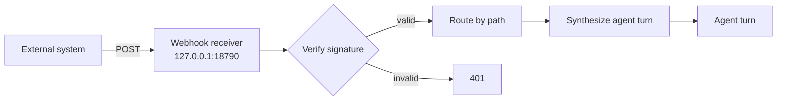

# Proactive engine

The proactive engine is the part of FlopsyBot that initiates conversations without waiting for a user to message first. It supports three trigger types:

- **Heartbeats** — periodic agent pings ("check my inbox every 30 min")
- **Cron jobs** — scheduled fires on a calendar expression ("every weekday at 8 am")
- **Inbound webhooks** — external systems wake the agent ("GitHub pushed a release")

All three produce an `ExecutionJob` that flows through the same pipeline — the only difference is when and how it's triggered.

## Where schedules live

**In the DB — not in `flopsy.json5`.**

```
~/.flopsy/state/proactive.db   ← single source of truth (SQLite)
~/.flopsy/state/proactive.json ← engine state (presence, queue, oneshot markers)
```

Every heartbeat, cron job, and webhook is a row in `proactive_runtime_schedules`. You manage them three ways:

1. **Ask the agent in chat** — "remind me at 4pm to call mom", "disable the morning briefing"
2. **CLI (read-only today):** `flopsy schedule list` / `show`
3. **Edit the DB directly** while the gateway is stopped (power users)

`flopsy.json5` keeps only the infrastructure knobs — master toggles and the fallback delivery target.

## Migration from earlier versions

If you have heartbeats or cron jobs defined in `flopsy.json5` from before this version, they're **imported one-time on first boot**. The marker `configSeededAt` in `proactive.json` tracks this — subsequent edits to those flopsy.json5 sections are advisory only. After migration you'll see:

```
Imported N schedules from flopsy.json5 into proactive.db. Future edits: use
`flopsy schedule ...` or the manage_schedule tool. The flopsy.json5
proactive.heartbeats / .scheduler sections are now advisory.
```

You can remove the `heartbeats` / `scheduler.jobs` entries from flopsy.json5 after migration.

## Configuration

The slim `proactive` block in `flopsy.json5`:

```json5
proactive: {
    // Master on/off — does the engine run at all?
    enabled: true,

    statePath: "state/proactive.json",
    retryQueuePath: "state/retry-queue.json",

    // Where messages go when a schedule doesn't specify its own `delivery`.
    delivery: {
        channelName: "telegram",
        peer: { id: "YOUR_CHAT_ID", type: "user" }
    },

    // When true, proactive messages route to the channel+peer of the user's
    // MOST RECENT inbound message (instead of the static delivery above).
    // Falls back to `delivery` when no inbound activity has been recorded.
    followActiveChannel: false,

    // Subsystem toggles — flip off to pause one trigger type without deleting.
    heartbeats: { enabled: true },
    scheduler:  { enabled: true },

    // Legacy — schedules live in proactive.db now. See above.
    webhooks: [],

    healthMonitor: {
        enabled: true,
        checkIntervalMs: 300000,
        staleEventThresholdMs: 600000,
        connectGraceMs: 60000,
        maxRestartsPerHour: 10,
        cooldownCycles: 2
    }
}
```

## Delivery modes

Every schedule has a `deliveryMode` that controls **whether** the agent's reply reaches the user. The destination is separate — controlled by `delivery` or `followActiveChannel`.

| Mode | What happens | Use when |
|---|---|---|
| `always` | The agent's reply is always sent | Scheduled briefings / unconditional reports |
| `conditional` | Agent returns structured JSON `{shouldDeliver, message, reason, topics?, reportedIds?}`. Suppress if `shouldDeliver=false`. | Polls that shouldn't alert on quiet days (email triage, news digest) |
| `silent` | Agent runs for side-effects only; nothing is delivered | Background bookkeeping, memory updates, system-health checks |

## Delivery routing

When a schedule fires, the engine resolves the target at **fire time** (not register time):

```
1. Schedule has explicit `delivery` set?          → use it
2. followActiveChannel=true and we have a live
   inbound peer?                                  → use it
3. Fall back to proactive.delivery                → use it
4. None of the above                              → log warning, skip fire
```

"Fire time" matters — `followActiveChannel` picks up the channel where you're chatting **right now**, not where you were when the schedule was registered.

## Dedup

Every delivered message is embedded (via `memory.embedder`) and the next delivery is cosine-compared against the last 48h. Suppressed if similarity ≥ 0.88. Lives in `proactive_deliveries` inside `proactive.db`.

> Earlier versions of FlopsyBot had two additional layers (topic tags + REPORTED-ID tracking) that the agent participated in via an `<anti_repetition>` prompt block. Those were removed — they added prompt bloat for marginal benefit. Embedding similarity is the only auto-dedup gate now.

## Prompt blocks assembled per fire

Each fire prepends these XML-tagged blocks to the agent's prompt (executor.ts):

| Block | Source | Purpose |
|---|---|---|
| `<active_skills>` | Job frontmatter `skills:` resolved by `skill-loader.ts` | Bind specific SKILL.md bodies for this fire |
| `<fire_context>` | `buildDateContext()` | Current date / time / IANA timezone |
| `<output_quality>` | `buildQualityGuidance(store)` | Quality guidance derived from recent fire history (categories, silence reasons) |
| `<pre_check>` | `preCheckScript` output (when configured) | Deterministic script output the agent reads before deciding |

The user's actual `job.prompt` is appended at the end.

## One-shot

Both heartbeats and cron jobs support `oneshot: true`. The job fires once, sets `enabled: false` in memory, and persists the completion ID to `completedOneshots[]` in `proactive.json`. On restart, the engine sees the ID and **skips re-registration** — so a restart never re-fires a one-shot.

For cron, `schedule.kind: "at"` is naturally one-shot (fires once at `atMs`, never again). For `kind: "every"` or `kind: "cron"` you need `payload.oneshot: true` explicitly.

## Heartbeats

A heartbeat is a timer that fires on a fixed interval. Use it for polling work.

| Field | Meaning |
|---|---|
| `id` | Stable id for tracking; defaults to `heartbeat-<name>` |
| `name` | Human-readable label |
| `enabled` | Skip without removing |
| `interval` | Duration string: `30s` `5m` `1h` `1d` |
| `oneshot` | Fire once then auto-disable (survives restart) |
| `prompt` | Inline prompt the agent receives |
| `promptFile` | Path to a prompt file — copied into `~/.flopsy/proactive/heartbeats/` on create, deleted on remove |
| `deliveryMode` | `always` / `conditional` / `silent` |
| `activeHours` | `{ start: 8, end: 22 }` — skip outside these hours |
| `delivery` | Override the default delivery target |

Fire timing is based on the gateway's wall-clock. Missed ticks during downtime are NOT replayed — if the gateway was off at 09:00, the 09:00 fire simply doesn't happen.

## Cron jobs

| Field | Meaning |
|---|---|
| `id` | Unique id (required) |
| `name` | Human-readable label |
| `schedule` | Tagged union — see below |
| `payload.message` | Inline prompt |
| `payload.promptFile` | Path to a prompt file — copied into `~/.flopsy/proactive/cron/` on create, deleted on remove |
| `payload.deliveryMode` | `always` / `conditional` / `silent` |
| `payload.oneshot` | Fire once then stop |
| `payload.threadId` | Reuse a persistent thread (gives the agent memory across fires) |
| `payload.delivery` | Override the default delivery target |

### Three `schedule.kind` values

```json5
// Fire exactly once at an absolute moment (epoch ms).
schedule: { kind: "at", atMs: 1735689600000 }

// Fire on a fixed interval, optionally phase-anchored.
schedule: { kind: "every", everyMs: 3600000 }
schedule: { kind: "every", everyMs: 3600000, anchorMs: 0 }  // top of every hour

// Fire on a cron expression (5-field) with IANA timezone.
schedule: { kind: "cron", expr: "0 8 * * 1-5", tz: "Africa/Nairobi" }
```

Cron expressions use standard 5-field syntax (`min hour day month weekday`) via [croner](https://www.npmjs.com/package/croner). No seconds field, no `@reboot` extension.

## Webhooks (inbound)

Webhooks let external systems trigger an agent turn — GitHub release events, Stripe payment notifications, Zapier pushes, CI result pings.



The top-level `webhook` block in flopsy.json5 controls the receiver server:

- `enabled` — start the receiver at all
- `host` / `port` — bind address (loopback by default)
- `allowedIps` — IP allow-list; empty = any. For public receivers, put the provider's documented IP range here

> Webhook definitions are currently still in-config; the migration to `proactive.db` is next pass.

Signature verification auto-detects 80+ provider headers (`x-hub-signature-256` for GitHub, `stripe-signature` for Stripe, etc.). See `src/gateway/src/core/security.ts`.

## Managing schedules

### From chat (agent tool)

Ask the agent naturally:

```
"remind me at 4pm to call mom"            → cron, kind="at", oneshot
"check my inbox every 30 minutes"          → heartbeat, interval="30m"
"every Monday at 9am give me a briefing"   → cron, kind="cron"
"one-time weekly review, this Sunday"      → cron, kind="cron", oneshot=true
"disable the morning briefing"
"what schedules do I have?"
"remove the news digest"
```

The agent calls the `manage_schedule` tool which writes to `proactive.db` and hot-registers the change with the live engine — no restart needed.

**Recursion guard:** an agent session that was itself invoked by a cron/heartbeat fire **cannot** create or modify schedules (only `list`). This prevents runaway loops where a cron job creates more cron jobs.

### From CLI (read-only today)

```bash
flopsy schedule list                    # all schedules
flopsy schedule list --kind heartbeat   # filter by kind
flopsy schedule show <id>               # full detail
flopsy schedule modify                  # help on how to modify
```

Write operations (`add`, `remove`, `disable`, `enable`) via CLI require the gateway to not be running (to avoid split-brain with the live trigger registry) OR a management HTTP endpoint that proxies through the running engine. The HTTP path is planned; for now use the agent tool.

## Observability

Every fire logs the decision chain:

- `proactive.heartbeat.fire` / `proactive.cron.fire` / `proactive.webhook.receive`
- `proactive.suppressed` with `{ reason, matchedSource, similarity }` when dedup kicks in
- `proactive.delivered` with `{ jobId, durationMs }`

`flopsy status` surfaces a snapshot: running state, heartbeat count, cron count, last fire timestamp.

## Implementation

| Path | Role |
|---|---|
| `src/gateway/src/proactive/engine.ts` | Orchestrator — owns triggers + stores, seeds config on first boot |
| `src/gateway/src/proactive/triggers/heartbeat.ts` | Interval timers, one-shot handling |
| `src/gateway/src/proactive/triggers/cron.ts` | Croner-driven schedule + `at`/`every`/`cron` |
| `src/gateway/src/proactive/triggers/webhook.ts` | Inbound HTTP route builder |
| `src/gateway/src/proactive/pipeline/executor.ts` | Runs the agent, applies dedup, delivers |
| `src/gateway/src/proactive/pipeline/skill-loader.ts` | Resolves job `skills:` frontmatter into `<active_skills>` |
| `src/gateway/src/proactive/state/dedup-store.ts` | SQLite — deliveries + embeddings + runtime schedules |
| `src/gateway/src/proactive/state/store.ts` | JSON state — presence, queue, oneshot markers, seed marker |
| `src/team/src/tools/manage-schedule.ts` | Agent-facing tool |
| `src/cli/src/ops/schedule-command.ts` | `flopsy schedule` CLI |
