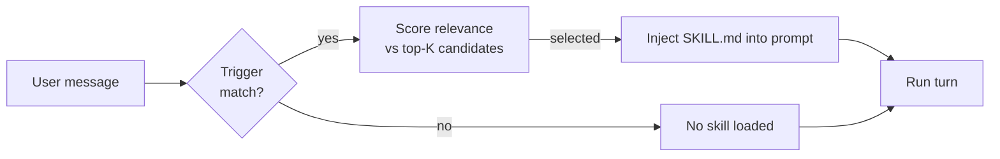

# Skills

A **skill** is a reusable chunk of knowledge + instructions that an agent can load on demand. Skills live as plain markdown files under `.flopsy/skills/<skill-name>/SKILL.md`. When an agent is asked a question that matches a skill's trigger, the skill content is spliced into the prompt for that turn only.

The shipped library has 79 skills spanning research (`arxiv-search`, `web-research`), productivity (`habit-tracker`, `scheduler`), coding (`code-review`, `debugging`, `project-scaffolding`), channel-specific behaviour (`telegram`, `discord`, `whatsapp`), and meta-capabilities (`self-critique`, `summarization`, `step-sequencer`).

## Anatomy of a skill

```
.flopsy/skills/
└── arxiv-search/
    ├── SKILL.md            # required — front-matter + instructions
    ├── example-query.md    # optional — reference material loaded on demand
    └── assets/             # optional — images, templates, scripts
```

A minimal `SKILL.md`:

```markdown
---
name: arxiv-search
description: Find and summarise papers from arXiv by query or author.
triggers:
  - "arxiv"
  - "paper about"
  - "latest research on"
agents: [legolas]
---

When the user asks for papers or research:

1. Call `web_research` with site:arxiv.org scoping.
2. For each result, fetch the abstract page.
3. Return title, authors, one-sentence summary, DOI, and pub date.
4. Offer to delegate a deeper read via `fetch_pdf_and_extract`.
```

Field-by-field:

- **`name`** — filesystem slug; must match the directory.
- **`description`** — one-line purpose (shown in `flopsy skills list` and in agent routing decisions).
- **`triggers`** — literal substrings that suggest this skill is relevant. The skill loader uses fuzzy matching + an LLM-based rerank.
- **`agents`** — which agents may load this skill. Empty / omitted = available to all.

The markdown body is the **instruction payload** — it goes directly into the system prompt for the turn.

## How skills load



- The skill loader runs before the LLM call.
- At most N skills are injected per turn (default 2) to keep the prompt compact.
- Loaded skills are logged (`flopsy mgmt status` shows recent skill activations).
- Skills are **cached in memory** at gateway start — editing a `SKILL.md` and restarting the gateway picks up the change.

## Built-in skill taxonomy

```mermaid
flowchart TB
  SKILLS[skills/]
  SKILLS --> RESEARCH[Research]
  SKILLS --> CODING[Coding]
  SKILLS --> PRODUCTIVITY[Productivity]
  SKILLS --> COMMUNICATION[Channel-specific]
  SKILLS --> REASONING[Reasoning / meta]
  SKILLS --> SECURITY[Security / safety]

  RESEARCH --> R1[arxiv-search]
  RESEARCH --> R2[web-research]
  RESEARCH --> R3[verification]
  RESEARCH --> R4[source-assessment]

  CODING --> C1[code-review]
  CODING --> C2[debugging]
  CODING --> C3[project-scaffolding]
  CODING --> C4[github]

  PRODUCTIVITY --> P1[habit-tracker]
  PRODUCTIVITY --> P2[daily-rhythm]
  PRODUCTIVITY --> P3[plan-my-day]
  PRODUCTIVITY --> P4[scheduler]

  COMMUNICATION --> CO1[telegram]
  COMMUNICATION --> CO2[discord]
  COMMUNICATION --> CO3[whatsapp]
  COMMUNICATION --> CO4[slack]

  REASONING --> M1[self-critique]
  REASONING --> M2[critical-analysis-chain]
  REASONING --> M3[summarization]
  REASONING --> M4[step-sequencer]

  SECURITY --> S1[skill-security]
  SECURITY --> S2[privacy-audit]
  SECURITY --> S3[propaganda-recognition]
```



## Writing your own skill

```bash
# 1. Create the directory
mkdir -p .flopsy/skills/my-skill

# 2. Write SKILL.md (see template above)
$EDITOR .flopsy/skills/my-skill/SKILL.md

# 3. Restart the gateway so it's indexed
flopsy gateway restart
```

Good skills are:

- **Narrow.** One purpose per skill. "Research + summarise + email" → three skills composed by the agent.
- **Trigger-specific.** Vague triggers (`"help"`) cause noise. Name the domain.
- **Under 2 KB.** Long skills blow the context budget. If you need more, split into assets loaded conditionally.
- **Grounded in tools.** Mention which tools (built-in or MCP) the agent should reach for. The agent will follow your instructions before defaulting to general reasoning.

## Related

- [Agents](./agents.md) — which agents get which skills
- [Tools](./tools.md) — the tools skills tell agents to use
- The `skill-creator` shipped skill is a meta-skill that walks you through writing a new one interactively
