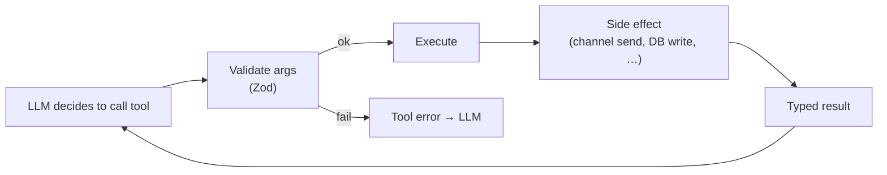

# Tools

Tools are the verbs an agent can invoke during a turn. FlopsyBot ships a small set of first-party built-in tools plus whatever you wire up via [MCP servers](./mcp.md). Each agent has an explicit **toolset allow-list**; agents only see tools from their allow-list plus routed MCP servers.

## Built-in tool catalog

| Tool | Purpose | Who typically uses it |
|---|---|---|
| `send_message` | Send a text/media message to a channel peer | Any agent with output |
| `send_poll` | Post a poll (channels that support it) | Main, during planning |
| `ask_user` | Channel-aware interactive question (buttons on rich channels, numbered prompts on text-only) | Main |
| `delegate_task` | Hand a task to a worker agent; block until reply | Main |
| `spawn_background_task` | Run a task asynchronously; reply comes later | Main |
| `search_past_conversations` | FTS5 query over messages in `state.db` | Any agent |
| `connect_service` | Initiate OAuth device-flow for a new service | Main |
| `react` | Add an emoji reaction to a message (channels that support it) | Any agent |

All tools live in `src/team/src/tools/`. Each is a single file exporting a schema + an execute function.

## Tool anatomy



Under the hood each tool has:

- **`name`** — what the LLM calls (`send_message`, `delegate_task`).
- **`description`** — one-sentence doc the LLM reads.
- **`schema`** — Zod schema for args; rejection is reported to the LLM as a soft error, not an exception.
- **`execute`** — async function, runs in the turn's context (access to channel registry, agent manager, memory store).
- **`allowedCallers`** — optional restriction to specific agents or to Anthropic's `code_execution_20250825` server-side runner.

## Toolsets

Agents don't enumerate every tool individually — they reference named bundles called **toolsets**. Toolsets live in code; each is a named list of tool instances. Common ones:

| Toolset | Tools | Typical audience |
|---|---|---|
| `core` | `send_message`, `react`, `search_past_conversations` | Every agent |
| `team` | `delegate_task`, `spawn_background_task`, `ask_user` | Main only |
| `memory` | memory read/write, user-fact tagging | Any agent that should personalize |
| `polling` | `send_poll` | Main on rich channels |

Configure in `flopsy.json5`:

```json5
{
  name: "gandalf",
  toolsets: ["core", "team", "memory", "polling"],
}
```

## Approvals

Tools can be gated behind human approval. When an agent tries to call a tool in the approval list, the gateway emits an `ask_user` turn on the active channel and pauses the conversation until the user clicks approve/deny.

```json5
{
  name: "gandalf",
  approvals: {
    tools: ["send_poll", "connect_service"],
    actions: ["delete_thread", "revoke_auth"]
  }
}
```

Approval buttons render natively on Telegram/Discord/Slack/Line and fall back to `1. Approve / 2. Deny` text on SMS-style channels (iMessage, Signal, WhatsApp).

## MCP tools

MCP servers contribute additional tools at runtime. Tool names are namespaced as `<server>__<tool>` (e.g. `github__get_issue`, `filesystem__read_file`). Agents only see MCP tools from servers in their `mcpServers` allow-list. See [MCP](./mcp.md) for details.

## Programmatic tool calling

For complex multi-step workflows, FlopsyBot supports **programmatic tool calling**: instead of the LLM making N separate tool calls, it writes a small Python/JS script that invokes tools as normal functions through a local HTTP bridge. Saves turn count, works with any LLM provider (not only Anthropic).

Enable per-agent:

```json5
{
  name: "saruman",
  programmaticToolCalling: true
}
```

The bridge is a localhost HTTP server spawned by the sandbox module; the injected runtime stubs forward calls to the agent's tool set. Code runs in a sandbox (local / Docker / Kubernetes backend).

## Observability

Every tool invocation logs:

- `tool_name`, agent, `turn_id`, `thread_id`
- arg keys (values redacted to avoid leaking secrets)
- duration, success / failure
- any downstream events (channel send → message id)

`flopsy mgmt status` aggregates today's tool calls per agent.

## Related

- [Agents](./agents.md) — who gets which toolsets
- [Skills](./skills.md) — skills tell agents which tools to reach for
- [MCP](./mcp.md) — adding external tools via MCP servers
