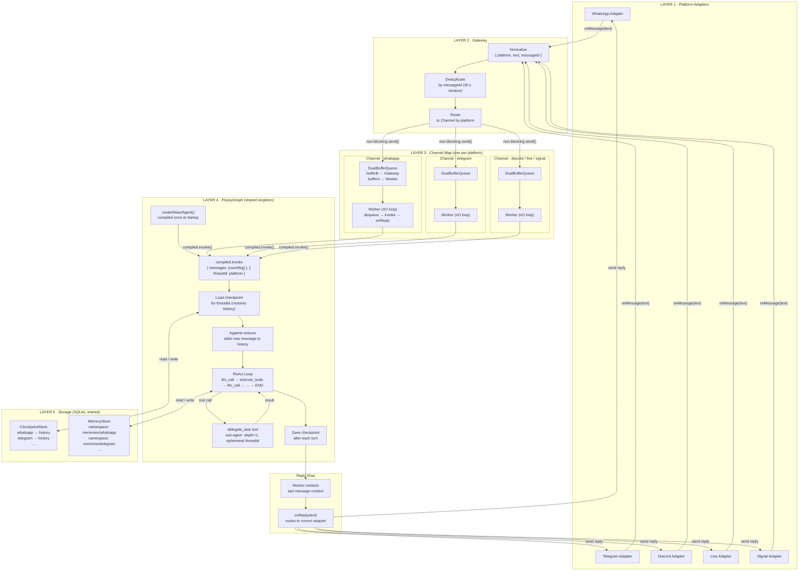
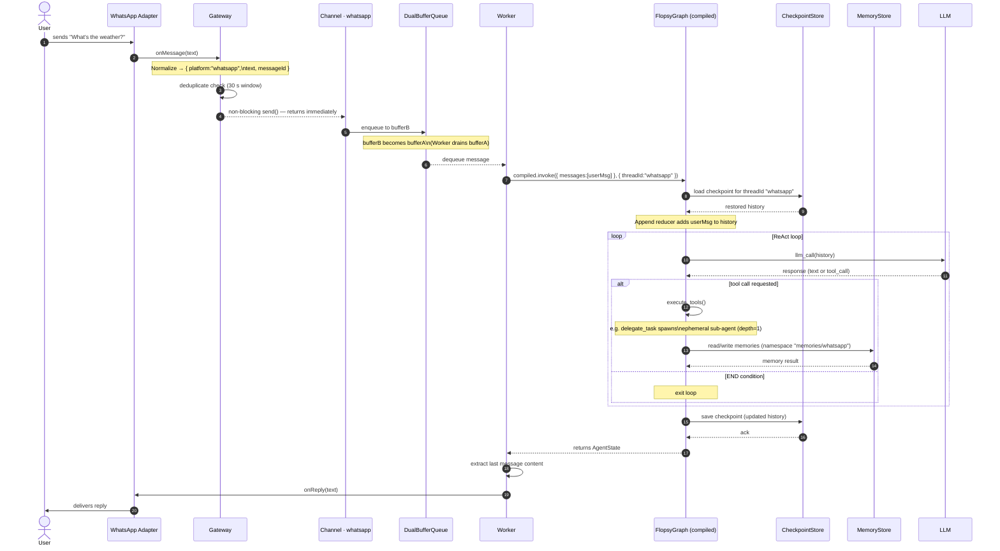

# FlopsyBot Architecture

## Diagram 1 — Full Message Flow (Flowchart)

```mermaid
flowchart TD
    %% ── LAYER 1: Platform Adapters ──────────────────────────────────────
    subgraph L1["LAYER 1 · Platform Adapters"]
        direction LR
        WA["WhatsApp Adapter"]
        TG["Telegram Adapter"]
        DC["Discord Adapter"]
        LN["Line Adapter"]
        SG["Signal Adapter"]
    end

    %% ── LAYER 2: Gateway ────────────────────────────────────────────────
    subgraph L2["LAYER 2 · Gateway"]
        direction TB
        NORM["Normalize\n{ platform, text, messageId }"]
        DEDUP["Deduplicate\nby messageId (30 s window)"]
        ROUTE["Route\nto Channel by platform"]
        NORM --> DEDUP --> ROUTE
    end

    %% ── LAYER 3: Channel Map ────────────────────────────────────────────
    subgraph L3["LAYER 3 · Channel Map  (one per platform)"]
        direction TB

        subgraph CH_WA["Channel · whatsapp"]
            BUF_WA["DualBufferQueue\nbufferB ← Gateway\nbufferA → Worker"]
            WRK_WA["Worker (nO loop)\ndequeue → invoke → onReply"]
            BUF_WA --> WRK_WA
        end

        subgraph CH_TG["Channel · telegram"]
            BUF_TG["DualBufferQueue"]
            WRK_TG["Worker (nO loop)"]
            BUF_TG --> WRK_TG
        end

        subgraph CH_OT["Channel · discord / line / signal"]
            BUF_OT["DualBufferQueue"]
            WRK_OT["Worker (nO loop)"]
            BUF_OT --> WRK_OT
        end
    end

    %% ── LAYER 4: FlopsyGraph ────────────────────────────────────────────
    subgraph L4["LAYER 4 · FlopsyGraph  (shared singleton)"]
        direction TB
        CRT["createReactAgent()\ncompiled once at startup"]
        INV["compiled.invoke\n{ messages: [userMsg] }, { threadId: platform }"]
        CHK_LOAD["Load checkpoint\nfor threadId (restores history)"]
        REDUCE["Append reducer\nadds new message to history"]
        REACT["ReAct Loop\nllm_call → execute_tools → llm_call → … → END"]
        DELEGATE["delegate_task tool\nsub-agent  depth=1, ephemeral threadId"]
        CHK_SAVE["Save checkpoint\nafter each turn"]

        CRT --> INV --> CHK_LOAD --> REDUCE --> REACT
        REACT -->|"tool call"| DELEGATE
        DELEGATE -->|"result"| REACT
        REACT --> CHK_SAVE
    end

    %% ── LAYER 5: Storage ────────────────────────────────────────────────
    subgraph L5["LAYER 5 · Storage  (SQLite, shared)"]
        direction LR
        CP["CheckpointStore\nwhatsapp → history\ntelegram → history\n…"]
        MEM["MemoryStore\nnamespace: memories/whatsapp\nnamespace: memories/telegram\n…"]
    end

    %% ── REPLY FLOW ──────────────────────────────────────────────────────
    subgraph REPLY["Reply Flow"]
        direction TB
        EXT["Worker extracts\nlast message content"]
        ON_REPLY["onReply(text)\nroutes to correct adapter"]
    end

    %% ── EDGES ───────────────────────────────────────────────────────────
    WA & TG & DC & LN & SG -->|"onMessage(text)"| NORM

    ROUTE -->|"non-blocking send()"| BUF_WA
    ROUTE -->|"non-blocking send()"| BUF_TG
    ROUTE -->|"non-blocking send()"| BUF_OT

    WRK_WA & WRK_TG & WRK_OT -->|"compiled.invoke()"| INV

    CHK_LOAD <-->|"read / write"| CP
    REACT    <-->|"read / write"| MEM

    CHK_SAVE --> EXT
    EXT --> ON_REPLY

    ON_REPLY -->|"send reply"| WA
    ON_REPLY -->|"send reply"| TG
    ON_REPLY -->|"send reply"| DC
    ON_REPLY -->|"send reply"| LN
    ON_REPLY -->|"send reply"| SG
```

---

## Diagram 2 — Single Message End-to-End (Sequence Diagram)

```mermaid
sequenceDiagram
    autonumber

    actor User
    participant WA   as WhatsApp Adapter
    participant GW   as Gateway
    participant CH   as Channel · whatsapp
    participant BUF  as DualBufferQueue
    participant WRK  as Worker
    participant FG   as FlopsyGraph (compiled)
    participant CP   as CheckpointStore
    participant MEM  as MemoryStore
    participant LLM  as LLM

    %% ── Inbound ──────────────────────────────────────────────────────
    User  ->>  WA  : sends "What's the weather?"
    WA    ->>  GW  : onMessage(text)

    Note over GW: Normalize → { platform:"whatsapp",\ntext, messageId }
    GW    ->>  GW  : deduplicate check (30 s window)
    GW    -->> CH  : non-blocking send() — returns immediately
    CH    ->>  BUF : enqueue to bufferB

    %% ── Channel swap ─────────────────────────────────────────────────
    Note over BUF: bufferB becomes bufferA\n(Worker drains bufferA)
    BUF   -->> WRK : dequeue message

    %% ── FlopsyGraph invocation ───────────────────────────────────────
    WRK   ->>  FG  : compiled.invoke({ messages:[userMsg] }, { threadId:"whatsapp" })

    FG    ->>  CP  : load checkpoint for threadId "whatsapp"
    CP    -->> FG  : restored history

    Note over FG: Append reducer adds userMsg to history

    %% ── ReAct loop ───────────────────────────────────────────────────
    loop ReAct loop
        FG    ->>  LLM : llm_call(history)
        LLM   -->> FG  : response (text or tool_call)

        alt tool call requested
            FG    ->>  FG  : execute_tools()
            Note over FG: e.g. delegate_task spawns\nephemeral sub-agent (depth=1)
            FG    ->>  MEM : read/write memories (namespace "memories/whatsapp")
            MEM   -->> FG  : memory result
        else END condition
            Note over FG: exit loop
        end
    end

    FG    ->>  CP  : save checkpoint (updated history)
    CP    -->> FG  : ack

    FG    -->> WRK : returns AgentState

    %% ── Reply flow ───────────────────────────────────────────────────
    WRK   ->>  WRK : extract last message content
    WRK   ->>  WA  : onReply(text)
    WA    ->>  User : delivers reply
```
